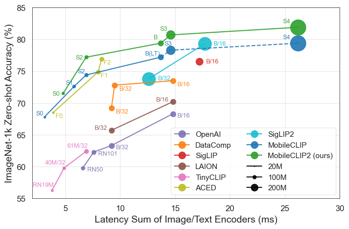

# MobileCLIP: Fast Image-Text Models through Multi-Modal Reinforced Training

This is the official repository of
- **[MobileCLIP2: Improving Multi-Modal Reinforced Training](http://arxiv.org/abs/2508.20691). (TMLR August 2025 <mark>Featured</mark>)**
*Fartash Faghri, Pavan Kumar Anasosalu Vasu, Cem Koc, Vaishaal Shankar, Alexander T Toshev, Oncel Tuzel, Hadi Pouransari.*
- **[MobileCLIP: Fast Image-Text Models through Multi-Modal Reinforced Training](https://arxiv.org/pdf/2311.17049.pdf). (CVPR 2024)**
*Pavan Kumar Anasosalu Vasu, Hadi Pouransari, Fartash Faghri, Raviteja Vemulapalli, Oncel Tuzel.*

The repository contains code for inference, training, and evaluation of MobileCLIP models trained on DataCompDR datasets and MobileCLIP2 models trained on DFNDR dataset.

**For code to generate multi-modal reinforced datasets at large scale see [ml-mobileclip-dr](https://github.com/apple/ml-mobileclip-dr) repository.**

[//]: # (![MobileCLIP Performance]&#40;docs/fig_accuracy_latency.png&#41;)
[//]: # (![MobileCLIP2 Performance]&#40;docs/fig_accuracy_latency_v2.png&#41;)
<p align="center">


</p>

- **Update 2025/08/28:** MobileCLIP2 [models](https://huggingface.co/collections/apple/mobileclip2-68ac947dcb035c54bcd20c47) are released as well as our [V2 training code](./training) and data generation code ([ml-mobileclip-dr](https://github.com/apple/ml-mobileclip-dr)).
- **Update 2025/07/22:** MobileCLIP2 accepted to TMLR with <mark>Featured Certification</mark>.
- **Update 2024/11/22:** Releasing iOS app to demonstrate the use of our model 
- for real-time zero-shot image classification. See [ios_app](./ios_app/).
- **Update 2024/06/13:** Releasing the code and scripts to train using [OpenCLIP](https://github.com/mlfoundations/open_clip/tree/main/src/open_clip) on DataCompDR datasets. See [training/](./training/).
- **Update 2024/06/13:** MobileCLIP models and DataCompDR datasets are now available on HuggingFace in [MobileCLIP/DataCompDR Collection](https://huggingface.co/collections/apple/mobileclip-models-datacompdr-data-665789776e1aa2b59f35f7c8).

### Highlights
* `MobileCLIP2-S4` matches the accuracy of SigLIP-SO400M/14 with 2x fewer parameters and surpasses DFN ViT-L/14 at 2.5x lower latency measured on iPhone12 Pro Max.
* `MobileCLIP-S3/S4` are our new architectures trained on MobileCLIP’s training dataset, DataCompDR-1B (dashed lines).
* Our smallest variant `MobileCLIP-S0` obtains similar zero-shot performance as [OpenAI](https://arxiv.org/abs/2103.00020)'s ViT-B/16 model while being 4.8x faster and 2.8x smaller.
* `MobileCLIP-S2` obtains better avg zero-shot performance than [SigLIP](https://arxiv.org/abs/2303.15343)'s ViT-B/16 model while being 2.3x faster and 2.1x smaller, and trained with 3x less seen samples.
* `MobileCLIP-B (LT)` attains zero-shot ImageNet performance of **77.2%** which is significantly better than recent works like [DFN](https://arxiv.org/abs/2309.17425) and [SigLIP](https://arxiv.org/abs/2303.15343) with similar architectures or even [OpenAI's ViT-L/14@336](https://arxiv.org/abs/2103.00020).
* iOS app to demonstrate the superior performance of our model on a mobile device.


## Getting Started

### Setup
```bash
conda create -n clipenv python=3.10
conda activate clipenv
pip install -e .
```

### OpenCLIP Support
Our models are now natively supported in OpenCLIP. To use MobileCLIP models in OpenCLIP, setup your environment as shown below,
```bash
conda create -n clipenv python=3.10
conda activate clipenv

# Clone OpenCLIP repository, add MobileCLIP2 models, and install
git clone https://github.com/mlfoundations/open_clip.git
pushd open_clip
git apply ../mobileclip2/open_clip_inference_only.patch
cp -r ../mobileclip2/* ./src/open_clip/
pip install -e .
popd

pip install git+https://github.com/huggingface/pytorch-image-models
```

To download pretrained checkpoints follow the code snippet below
```bash
# MobileCLIP2
for model in S0 S2 B S3 L-14 S4
do
  hf download apple/MobileCLIP2-$model
done

# MobileCLIP
for model in S0 S1 S2 B B-LT S3 L-14 S4
do
  hf download apple/MobileCLIP-$model
done
```

To run inference, see example below,
```python
import torch
import open_clip
from PIL import Image
from mobileclip.modules.common.mobileone import reparameterize_model

model, _, preprocess = open_clip.create_model_and_transforms('MobileCLIP2-S0', pretrained='/path/to/mobileclip2_s0.pt')
tokenizer = open_clip.get_tokenizer('MobileCLIP2-S0')

# For inference/model exporting purposes, please reparameterize first
model = reparameterize_model(model.eval())

image = preprocess(Image.open("docs/fig_accuracy_latency.png").convert('RGB')).unsqueeze(0)
text = tokenizer(["a diagram", "a dog", "a cat"])

with torch.no_grad(), torch.cuda.amp.autocast():
    image_features = model.encode_image(image)
    text_features = model.encode_text(text)
    image_features /= image_features.norm(dim=-1, keepdim=True)
    text_features /= text_features.norm(dim=-1, keepdim=True)

    text_probs = (100.0 * image_features @ text_features.T).softmax(dim=-1)

print("Label probs:", text_probs)

```
Variants currently available on OpenCLIP, 
 `[('MobileCLIP-S1', 'datacompdr'),
  ('MobileCLIP-S2', 'datacompdr'),
  ('MobileCLIP-B', 'datacompdr'),
  ('MobileCLIP-B', 'datacompdr_lt')]`

<details>
<summary>V1-only usage example</summary>
To download pretrained checkpoints follow the code snippet below
```bash
source get_pretrained_models.sh   # Files will be downloaded to `checkpoints` directory.
```

To models from the official repo, follow the code snippet below
```python
import torch
from PIL import Image
import mobileclip

model, _, preprocess = mobileclip.create_model_and_transforms('mobileclip_s0', pretrained='/path/to/mobileclip_s0.pt')
tokenizer = mobileclip.get_tokenizer('mobileclip_s0')

image = preprocess(Image.open("docs/fig_accuracy_latency.png").convert('RGB')).unsqueeze(0)
text = tokenizer(["a diagram", "a dog", "a cat"])

with torch.no_grad(), torch.cuda.amp.autocast():
    image_features = model.encode_image(image)
    text_features = model.encode_text(text)
    image_features /= image_features.norm(dim=-1, keepdim=True)
    text_features /= text_features.norm(dim=-1, keepdim=True)

    text_probs = (100.0 * image_features @ text_features.T).softmax(dim=-1)

print("Label probs:", text_probs)
```
</details>


### Dataset
For an example of loading the data from HuggingFace see 
[hf_dataset_example.py](./hf_dataset_example.py).

## Evaluation
Please find the detailed evaluation results [here](./results).
To reproduce results, we provide script to perform zero-shot evaluation on ImageNet-1k dataset. 
To evaluate on all the 38 datasets, please follow instructions in [datacomp](https://github.com/mlfoundations/datacomp).
```bash
# Run evaluation with single GPU
python eval/zeroshot_imagenet.py --model-arch mobileclip_s0 --model-path /path/to/mobileclip_s0.pt
```

Please refer to [Open CLIP Results](https://github.com/mlfoundations/open_clip/blob/main/docs/openclip_results.csv) to compare with other models.

| Model                                                     | # Seen <BR>Samples (B) | # Params (M) <BR> (img + txt) | Latency (ms) <BR> (img + txt) | IN-1k Zero-Shot <BR> Top-1 Acc. (%) | Avg. Perf. (%) <BR> on 38 datasets |
|:----------------------------------------------------------|:----------------------:|:-----------------------------:|:-----------------------------:|:-----------------------------------:|:----------------------------------:|
| [MobileCLIP2-S0](https://hf.co/apple/MobileCLIP2-S0)      |           13           |          11.4 + 42.4          |           1.5 + 1.6           |               71.5                 |                59.7                 |
| [MobileCLIP2-S2](https://hf.co/apple/MobileCLIP2-S2)      |           13           |          35.7 + 63.4          |           3.6 + 3.3           |               77.2                 |                64.1                 |
| [MobileCLIP2-B](https://hf.co/apple/MobileCLIP2-B)        |           13           |          86.3 + 63.4          |          10.4 + 3.3           |               79.4                 |                65.8                 |
| [MobileCLIP2-S3](https://hf.co/apple/MobileCLIP2-S3)      |           13           |         125.1 + 123.6         |           8.0 + 6.6           |               80.7                 |                66.8                 |
| [MobileCLIP2-L/14](https://hf.co/apple/MobileCLIP2-L-14)  |           13           |         304.3 + 123.6         |          57.9 + 6.6           |               81.9                 |                67.8                 |
| [MobileCLIP2-S4](https://hf.co/apple/MobileCLIP2-S4)      |           13           |         321.6 + 123.6         |          19.6 + 6.6           |               81.9                 |                67.5                 |
| [MobileCLIP-S0](https://hf.co/apple/MobileCLIP-S0)        |           13           |          11.4 + 42.4          |           1.5 + 1.6           |               67.8                 |                58.1                 |
| [MobileCLIP-S1](https://hf.co/apple/MobileCLIP-S1)        |           13           |          21.5 + 63.4          |           2.5 + 3.3           |               72.6                 |                61.3                 |
| [MobileCLIP-S2](https://hf.co/apple/MobileCLIP-S2)        |           13           |          35.7 + 63.4          |           3.6 + 3.3           |               74.4                 |                63.7                 |
| [MobileCLIP-B](https://hf.co/apple/MobileCLIP-B)          |           13           |          86.3 + 63.4          |          10.4 + 3.3           |               76.8                 |                65.2                 |
| [MobileCLIP-B (LT)](https://hf.co/apple/MobileCLIP-B-LT)  |           36           |          86.3 + 63.4          |          10.4 + 3.3           |               77.2                 |                65.8                 |
| [MobileCLIP-S3](https://hf.co/apple/MobileCLIP-S3)        |           13           |         125.1 + 123.6         |           8.0 + 6.6           |               78.3                 |                66.3                 |
| [MobileCLIP-L/14](https://hf.co/apple/MobileCLIP-L-14)    |           13           |         304.3 + 123.6         |          57.9 + 6.6           |               79.5                 |                66.9                 |
| [MobileCLIP-S4](https://hf.co/apple/MobileCLIP-S4)        |           13           |         321.6 + 123.6         |          19.6 + 6.6           |               79.4                 |                68.1                 |

Note: MobileCLIP-B(LT) is trained for 300k iterations with constant learning rate schedule and 300k iterations with cosine learning rate schedule.

## CoCa Models

We release CoCa models used to generate synthetic captions in DFNDR-2B on 
HuggingFace. These models can be downloaded using the following instructions:

```bash
for model in \
  context77 \
  dci-complete_s12m_context128 \
  dci-complete_s12m_context256 \
  dci-complete_s12m_context77 \
  dci-extended_s12m_context128 \
  dci-extended_s12m_context256 \
  dci-extended_s12m_context77 \
  dci-short_s12m_context128 \
  dci-short_s12m_context256 \
  dci-short_s12m_context77 \
  docci_s12m_context128 \
  docci_s12m_context256 \
  docci_s12m_context77 \
  gbc10m-long_context256 \
  gbc10m-short-relation_context256 \
  gbc1m-long_context256 \
  gbc1m-short_context77 \
  mscoco38k_s12m_context77 \
  recap-coco-30k_s12m_context128 \
  recap-coco-30k_s12m_context256 \
  recap-coco-30k_s12m_context77 \
do
  hf download apple/mobileclip2_coca_dfn2b_s13b_$model
done
```

The following is a usage example. For models length with context lengths 128/256, copy `config.json` to `src/open_clip/model_configs/coca_ViT-L-14-context$len.json` and change the model name in below example to `coca_ViT-L-14-context$len`.

```python
import torch
import open_clip
from PIL import Image

model, _, preprocess = open_clip.create_model_and_transforms('coca_ViT-L-14', pretrained='/path/to/mobileclip2_coca.pt')
model.eval()

image = preprocess(Image.open("docs/fig_accuracy_latency.png").convert('RGB')).unsqueeze(0)

with torch.no_grad(), torch.cuda.amp.autocast():
    syn_text = model.generate(
        image,
        generation_type="top_p",
        top_p=0.9,
        fixed_output_length=True
    )[0]
    syn_text = open_clip.decode(syn_text).split("<end_of_text>")[0].split("<start_of_text>")[-1].split(".")[0].rstrip()
print("Caption:", syn_text)
```

## License

This software and accompanying data and models have been released under the
following licenses:
- Code: [MIT](./LICENSE)
- ML models: [Apple ML Research Model TOU](./LICENSE_MODELS)
- Data: [CC-BY-NC-ND](./LICENSE_DATA) [Deed](https://creativecommons.org/licenses/by-nc-nd/4.0/)

## Acknowledgements
Our codebase is built using multiple opensource contributions, please see [ACKNOWLEDGEMENTS](ACKNOWLEDGEMENTS) for more details. 

## Citation
If you found this code useful, please cite the following papers:

    @article{faghri2025mobileclip2,
      title={Mobile{CLIP}2: Improving Multi-Modal Reinforced Training},
      author={Fartash Faghri and Pavan Kumar Anasosalu Vasu and Cem Koc and 
      Vaishaal Shankar and Alexander T Toshev and Oncel Tuzel and Hadi 
      Pouransari},
      journal={Transactions on Machine Learning Research},
      issn={2835-8856},
      year={2025},
      url={https://openreview.net/forum?id=WeF9zolng8},
      note={Featured Certification}
    }


    @InProceedings{vasu2024mobileclip,
      author = {Vasu, Pavan Kumar Anasosalu and Pouransari, Hadi and Faghri, Fartash and Vemulapalli, Raviteja and Tuzel, Oncel},
      title = {MobileCLIP: Fast Image-Text Models through Multi-Modal Reinforced Training},
      booktitle = {Proceedings of the IEEE/CVF Conference on Computer Vision and Pattern Recognition (CVPR)},
      month = {June},
      year = {2024},
    }
