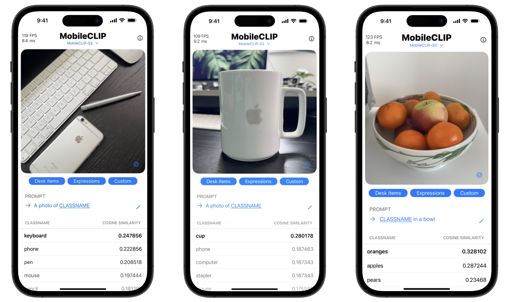
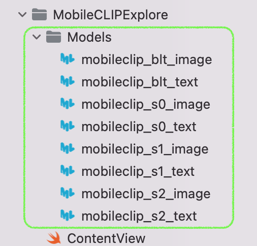

# MobileCLIPExplore
Demonstrates the use of **MobileCLIP** models for performing real-time zero-shot scene classification. Users can customize the prompts and provide classnames of their choice.

## Background
MobileCLIP is a new family of efficient image-text models optimized for runtime performance, trained with a novel and efficient training approach, namely multi-model reinforced training.

## Dependencies
Requires **iOS 17.2** or later.

## Install
1. Download the required CoreML models from [this link](https://huggingface.co/apple/coreml-mobileclip)

2. Place these models in the following directory:

`.../MobileCLIPExplore/MobileCLIPExplore/Models`

## Use

### Getting Started
1. Select from one of the four MobileCLIP models from the top menu.
2. Choose a prompt preset, or create a custom one.
3. Point the camera at a subject to display prediction results in the table below.

The FPS (frames per second) being analyzed and response time (milliseconds) of the prediction results are displayed in the top left of the landing view.

### Creating and Editing a Prompt
1. To edit the prompt, select the prompt or pencil icon ✎.
2. Tap the start or end of a prompt to customize the prefix or suffix, respectively.
3. Use the Classnames field to add or remove items you would like the app to detect. 

## Model Options
The application allows the user to select from four different MobileCLIP models:

| Name            | Ideal Latency | IN-1k Zero-Shot   Top-1 Acc. (%) | Avg. Perf. (%)   on 38 datasets |
|-----------------|---------------|-------|------------------------------------|
| MobileCLIP-S0   | 2.1 ms        | 67.8% | 58.1%                              |
| MobileCLIP-S1   | 5.8 ms        | 72.6% | 61.3%                              |
| MobileCLIP-S2   | 6.9 ms        | 74.4% | 63.7%                              |
| MobileCLIP-B (LT)| 13.7 ms      | 77.2% | 65.8%                              |

## Privacy
All predictions are processed privately and securely using on-device models.
